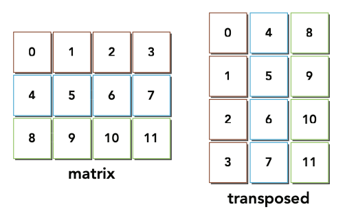
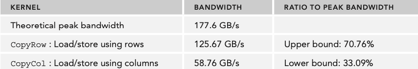
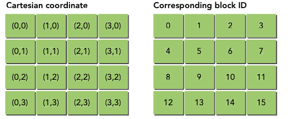
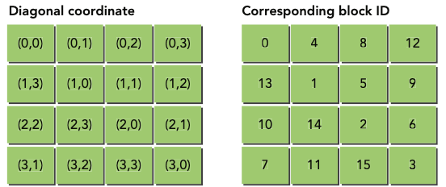
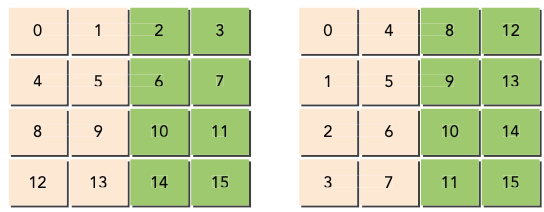
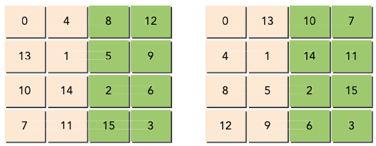

# matrix transpose algorithm CUDA-C
Simple example of a typical work flow to solve and optimize algorithm running on GPU 
with the support of command line nvprof profiling tool from Nvidia.  
*NOTE*: this project has been tested on *Nvidia's Tegra X1 GPU* (Maxwell architecture) 
		**you might have different behaviour if you run the code on a different GPU** 
*NOTE*: it is *required* to have installed *Nvidia CUDA Toolkit* on your machine 
*NOTE*: the makefile also supports the doxygen documentation, it is required to have 
		doxygen on your machine, *Doxyfile* is configured to automatically generate html 
		and LaTex documentation. LaTex documentation can be convered in pdf using another 
		*Makefile in docs/latex/* folder, but this requires to install additional tools. 
		*See the documentation section*
 

## **Additional tools**
The makefile does integrate Doxygen tool which is is the de facto standard used for generating documentation  
from annotated C, C++, C#, python, others.. source code. (additional informations https://www.doxygen.nl/index.html). 

HTML documentation only requires Doxygen  
LaTex (pdf) documentation requires additional tools (not mandatory if you do not need to generate the reference manual in pdf)

### **Install Doxygen**

*Install Doxygen (~100MB)*

	sudo apt-get install doxygen

### **Install Pdflatex**

*Install TexLive base (~150 MB)*

	sudo apt-get install texlive-latex-base

*Install additional fonts (~1300MB)*

	sudo apt-get install texlive-fonts-recommended
	sudo apt-get install texlive-fonts-extra

## **Matrix transpose problem**

The matrix transpose is a basic problem in linear algebra and widely used in many applications. 
Matrix transpose: 
 

The following is a host-based (CPU serial version) implementation of the transpose algorithm using single precision floating point values.
Suppose that the matrix is saved in a 1D array as row-major:

	for (int iy=0;iy<ny;iy++)
		for(int ix=0;ix<nx;ix++)
			transposed[ix*ny+iy]=original[iy*nx+ix]
as you can see it's very simple algrithm, just a matter of exchange x with y. 
 
Now, even if this algorithm is very simple, when it's time to optimize it for a GPU the problem becomes way more difficult.. 
In this application there are 7 version of matrix transpose algorithm tested on TEGRA X1. Results from others GPUs are shown just to stress the fact that different architectures may have different results.

## **Setting an upper and lower bound**

before seeing the matrix transpose kernels, in the file [common.cu](./src/common.cu) there are 2 kernels called **copyRow** and **copyCol**. 
Those examples are used to calculate rough upper and lower bounds (in terms of bandwidth) for all
transpose kernels and in general for all kernels involving matrixes. 
*bandwidth (GB/s or MB/s) is a widely used parameter in GPU, it is used to measure how fast a kernel is able to process datas*

- *copyRow* kernel that performs a copy of a matrix by loading and storing rows, this is an upper bound because all memory operations are coalesced.
- *copyCol* version that performs a copy of a matrix by loading and storing rows, this is worst case scenario for matrix operations because all memory operations are done only with strided accesses. 

### **Theoretical Peak bandwidth vs Effective Bandwidth**
There are two types of bandwidth:  
- Theoretical
- Effective

*Theoretical* is the absolute maximum bandwidth achievable with the hardware, usually declared from the company that sells teh GPU and for sure one of the most important parameter of a graphic card.  
Examples:
- Fermi M2090: 177.6 GB/s
- Tesla M2070: 150 GB/s (Launch Price 2011: 3099 USD)

*Effective* is the measured bandwidth that a kernel actually achieves, can be calculated using the following equation: 

	effBw= [ (bytes_read + bytes_written) x 10ˆ-9 ]/time_elapsed 

The following measurements comes from a Fermi M2090 with 16x16 block and 2048x2048 matrix and provide an upper bound, which is about 70% of theoretical peak bandwidth, and a lower bound that is 33% of theoretical peak:

## **Matrix Transpose Kernels implementation and CUDA profiler**
From now on the results will be analyzed using *nvprof* command line profiler on Jetson Nano board.

### **1) transposeNaiveRow kernel**
This is the first example of the transpose kernel, very straightforward to implement based on the host implementation. (following piece of code can be found in [matrixTranspose.cu](./matrixTranspose.cu))

	__global__ void transposeNaiveRow(float *in, float *out, unsigned int nx, unsigned int ny){
		unsigned int ix=blockDim.x * blockIdx.x + threadIdx.x;
		unsigned int iy=blockDim.y * blockIdx.y + threadIdx.y;
		if (ix>=nx || iy>=ny) return;
		out[ix*ny + iy]=in[iy*nx + ix];
	}

Here there are the interesting results coming from the profiler with **8192x8192 matrix and 16x16 block**:
- **global memory usage**

| gld_efficiency | gst_efficiency | gld_transactions | gst_transactions |
| :------------: | :------------: | :--------------: | :--------------: |
| 100 %   		 | 12.5 %         | 2097154			 | 4194304			|

- **shared memory usage**

| shared_load_transactions_per_request | shared_store_transactions_per_request | shared_efficiency |
| :------------: | :------------: | :--------------: |
| 0		   		 | 0	          | 0			     |

- **shared memory usage**

| achieved_occupancy | branch_efficiency |
| :------------: | :------------: |
| 0.84	   		 | 100%	          |

- **execution time** = **0.035000 s**

From these results is possible to understand that there is a bad usage of the memory due to strided global store operations.

### **2) transposeNaiveCol kernel**
Column based kernel obtained from the previous version just by exchanging the read and write indices  (following piece of code can be found in [matrixTranspose.cu](./matrixTranspose.cu))

	__global__ void transposeNaiveCol(float *in, float *out, unsigned int nx, unsigned int ny){
		unsigned int ix=blockDim.x * blockIdx.x + threadIdx.x;
		unsigned int iy=blockDim.y * blockIdx.y + threadIdx.y;
		if (ix>=nx || iy>=ny) return;
		out[iy*nx + ix]=in[ix*ny + iy];
	}

Here there are the interesting results coming from the profiler with **8192x8192 matrix and 16x16 block**:
- **global memory usage**

| gld_efficiency | gst_efficiency | gld_transactions | gst_transactions |
| :------------: | :------------: | :--------------: | :--------------: |
| 25 %   		 | 100 %          | 2097154			 | 524288			|

- **shared memory usage**

| shared_load_transactions_per_request | shared_store_transactions_per_request | shared_efficiency |
| :------------: | :------------: | :--------------: |
| 0		   		 | 0	          | 0			     |

- **shared memory usage**

| achieved_occupancy | branch_efficiency |
| :------------: | :------------: |
| 0.83	   		 | 100%	          |

- **execution time** = **0.020000 s**

Is possible to see that this kernel is for sure faster than the previous one (transposeNaiveRow). 
There are 2 important differences:
-	gst_efficiency (global store efficiency) has improoved from 12.5% to 100%, this is because the store operations are now coalesced, because of this also the gst_transaction are decresed by 1/8!!
-	the second difference is related to the global load efficiency (gld_efficiency) and the global load transactions (gld_transactions).  
**Even if the efficiency got worst (100% to 25%) why are the transactions still the same?** 
**This happened because the strided load operation have been cached in the on-chip fast L1 cache, so even if the strided access pattern is bad, the L1 cache hits avoid transactions replay.**

Note that store operation cannot be cached in L1 cache, that's why this kernel is faster than the orevious one!!

### **3) transposeUnrolling kernels**
The following two examples are using a technique called "**Block Unrolling**". 
The goal of unrolling is to assign more independent work to each thread in order to maximize the concurrent memory requests and so maximize the device_occupancy and avoid to many stalls in the cuda cores.  (following piece of code can be found in [matrixTranspose.cu](./matrixTranspose.cu)) 

**unrolled version of transposeNaiveRow kernel:**

	__global__ void transposeUnroll4Row(float *in, float *out, unsigned int nx, unsigned int ny)
	{
    	unsigned int ix = blockDim.x * blockIdx.x * 4 + threadIdx.x;
    	unsigned int iy = blockDim.y * blockIdx.y + threadIdx.y;

    	unsigned int ti = iy * nx + ix; // access in rows
    	unsigned int to = ix * ny + iy; // access in columns

    	if (ix + 3 * blockDim.x < nx && iy < ny)
    	{
        	out[to]                   = in[ti];
        	out[to + ny * blockDim.x]   = in[ti + blockDim.x];
        	out[to + ny * 2 * blockDim.x] = in[ti + 2 * blockDim.x];
        	out[to + ny * 3 * blockDim.x] = in[ti + 3 * blockDim.x];
    	}
	}

- **global memory usage**

| gld_efficiency | gst_efficiency | gld_transactions | gst_transactions |
| :------------: | :------------: | :--------------: | :--------------: |
| 100 %   		 | 12.5 %         | 2097154			 | 4194304			|

- **shared memory usage**

| shared_load_transactions_per_request | shared_store_transactions_per_request | shared_efficiency |
| :------------: | :------------: | :--------------: |
| 0		   		 | 0	          | 0			     |

- **shared memory usage**

| achieved_occupancy | branch_efficiency |
| :------------: | :------------: |
| 0.86	   		 | 100%	          |

- **execution time** = **0.075000 s**

**Worst than before!! this is because this kernel tries to issue more BAD independent operations**

**unrolled version of transposeNaiveCol kernel:**

	__global__ void transposeUnroll4Col(float *in, float *out, unsigned int nx, unsigned int ny)
	{
    	unsigned int ix = blockDim.x * blockIdx.x * 4 + threadIdx.x;
    	unsigned int iy = blockDim.y * blockIdx.y + threadIdx.y;

    	unsigned int ti = iy * nx + ix; // access in rows
    	unsigned int to = ix * ny + iy; // access in columns

    	if (ix + 3 * blockDim.x < nx && iy < ny)
    	{
        	out[ti]                = in[to];
        	out[ti +   blockDim.x] = in[to +   blockDim.x * ny];
        	out[ti + 2 * blockDim.x] = in[to + 2 * blockDim.x * ny];
        	out[ti + 3 * blockDim.x] = in[to + 3 * blockDim.x * ny];
    	}
	}

Here there are the interesting results coming from the profiler with **8192x8192 matrix and 16x16 block**:
- **global memory usage**

| gld_efficiency | gst_efficiency | gld_transactions | gst_transactions |
| :------------: | :------------: | :--------------: | :--------------: |
| 25 %   		 | 100 %          | 2097154			 | 524288			|

- **shared memory usage**

| shared_load_transactions_per_request | shared_store_transactions_per_request | shared_efficiency |
| :------------: | :------------: | :--------------: |
| 0		   		 | 0	          | 0			     |

- **shared memory usage**

| achieved_occupancy | branch_efficiency |
| :------------: | :------------: |
| 0.95	   		 | 100%	          |

- **execution time** = **0.015000 s**

**Is possible to see that all the parameters are the same but not the achieved occupancy (mooved from 0.83 -> 0.95)!!!** 
**This improvement is the real key of the speedup of an algorithm running on a GPU, because the more the device is occuped the more "in parallel the code runs", or better "more independent operations are issued in the cuda cores".**

### **4) transposeDiagonalRow kernel**
This example is a little bit more complex, it is related to a phenomenom called **partition camping** that may occur in DRAMs. 
If you run this code on Jetson Nano you won't probably notice any improvements in the performance, the follwing results comes from Fermi M2090 GPU  (following piece of code can be found in [matrixTranspose.cu](./matrixTranspose.cu))

	__global__ void transposeDiagonalRow(float *in, float *out, unsigned int nx, unsigned int ny)
	{
    	unsigned int blk_y = blockIdx.x;
    	unsigned int blk_x = (blockIdx.x + blockIdx.y) % gridDim.x;

    	unsigned int ix = blockDim.x * blk_x + threadIdx.x;
    	unsigned int iy = blockDim.y * blk_y + threadIdx.y;

    	if (ix < nx && iy < ny)
    	{
        	out[ix * ny + iy] = in[iy * nx + ix];
    	}
	}

#### **Partition Camping in DRAM**

*from book: professional-cuda-c-programming*  
When you launch a grid of thread blocks, the thread blocks are distributed among SMs. While programming model abstractions may present that grid to you in a 1D or 2D layout, **from the hardware perspective all blocks are arranged one-dimensionally**. Each block has its own unique identifer, *bid*, which is calculated using a row-major ordering of thread blocks in a grid: 

	int bid = blockIdx.y * gridDim.x + blockIdx.x;

*following figure illustrates a simple example of a 4 x 4 grid of thread blocks and the corresponding block ID of each thread block:*  

When a kernel is launched, the order in which thread blocks are assigned to SMs is determined by the block ID. Once all SMs are at full occupancy any remaining thread blocks are held until currently executing ones complete. Once a thread block completes, another thread block is assigned to that SM. Because **the speed and order in which thread blocks complete is not deterministic**, **active thread blocks that are initially contiguous by bid become less contiguous over time as execution** of the kernel progresses.
 

Although you do not have direct control over the order in which thread blocks are scheduled, you can be "exible in how you interpret the block coordinates blockIdx.x and blockIdx.y. 
*diagonal coordinate system and block id used by transposeDiagonalRow Kernel*

The reason for the probable performance improvement is related to the parallel access of DRAM. Requests to global memory are serviced by DRAM partitions. **Successive 256-byte regions of device memory are assigned to successive partitions**. When **using Cartesian coordinates to map thread blocks to data blocks, global memory accesses may not be evenly distributed among DRAM partitions**,
and a phenomenon called **partition camping** may occur. **In partition camping, memory requests are queued at some partitions while other partitions remain unused**. Because **the diagonal coordinate mapping** causes non-linear mappings from thread blocks to the data blocks they process, **strided accesses are unlikely to fall into a single partition**, **and performance improves as a result**.

The following figure shows that cartesian coordinates in the matrix transpose may produce partition camping becaus ethe store operations are not very well distributed among partitions. 
suppose you only have two partitions through which to access global memory, each with a partition width of 256 bytes, and that your kernel is launched with a block size of 32 x 32 threads. If each data block is 128 bytes wide, you will load data for thread blocks 0, 1, 2, and 3 using two partitions. However, you will store data for thread blocks 0, 1, 2, and 3 using only one partition and thus causing partition camping. 

Same algorithm but runned using diagonal coordinates, now both load and store operations are evenly distributed among partitions. 
In this case, you will load and store data for thread blocks 0, 1, 2, and 3 using two partitions. Both load and store requests are evenly distributed between the two partitions. This explains why the diagonal kernel achieves better performance. 

### **5) transposeSmemUnrollPadDyn kernel**
This example is a version of the previous tranposeNaiveRow kernel with the usage of the **shared memory**. 
The **shared memory is used to basically re-arrange data locally** (in the shared memory which is is an on-chip memory shared among threads in a block) **in such a way that also the write operations on global memory will be coalesced**. (following piece of code can be found in [matrixTranspose.cu](./matrixTranspose.cu))

	__global__ void transposeSmemUnrollPadDyn (float *in, float *out, unsigned int nx, unsigned int ny)
	{
    	extern __shared__ float tile[];

    	unsigned int ix = blockDim.x * blockIdx.x * 2 + threadIdx.x;
    	unsigned int iy = blockDim.y * blockIdx.y + threadIdx.y;

    	unsigned int ti = iy * nx + ix;

    	unsigned int bidx = threadIdx.y * blockDim.x + threadIdx.x;
    	unsigned int irow = bidx / blockDim.y;
    	unsigned int icol = bidx % blockDim.y;

    	// coordinate in transposed matrix
    	unsigned int ix2 = blockDim.y * blockIdx.y + icol;
    	unsigned int iy2 = blockDim.x * 2 * blockIdx.x + irow;
    	unsigned int to = iy2 * ny + ix2;

    	// transpose with boundary test
    	if (ix + blockDim.x < nx && iy < ny)
    	{
        	// load data from global memory to shared memory
        	unsigned int row_idx = threadIdx.y * (blockDim.x * 2 + IPAD) + threadIdx.x;
        	tile[row_idx]       = in[ti];
        	tile[row_idx + BDIMX] = in[ti + BDIMX];

        	// thread synchronization
        	__syncthreads();

        	unsigned int col_idx = icol * (blockDim.x * 2 + IPAD) + irow;
        	out[to] = tile[col_idx];
        	out[to + ny * BDIMX] = tile[col_idx + BDIMX];
    	}
	}

Here there are the interesting results coming from the profiler with **8192x8192 matrix and 16x16 block**:
- **global memory usage**

| gld_efficiency | gst_efficiency | gld_transactions | gst_transactions |
| :------------: | :------------: | :--------------: | :--------------: |
| 100 %   		 | 100 %          | 2097154			 | 524288			|

- **shared memory usage**

| shared_load_transactions_per_request | shared_store_transactions_per_request | shared_efficiency |
| :------------: | :------------: | :--------------: |
| 1	   		     | 1	          | 50%			     |

- **shared memory usage**

| achieved_occupancy | branch_efficiency |
| :------------: | :------------: |
| 0.98	   		 | 100%	          |

- **execution time** = **0.012000 s**
 
 

## **Grid Level Optimization**
This is the final part of the analysis 
One simple but effective optimization technique is the adjustment of thread block dimensions to discover the best execution configuration 
The best block configuration is not easy to determine a priori, can be determined with different tries. 

In my case i found that **the best best configuration for the transposeSmemUnrollPadDyn kernel is the Block(256,1) for a 8192x8192 matrix., the exution time was 0.009000 s**

*You can run the profiler script and let him find the best configuration for a selected kernel but this operation may require quite a lot of time!!*

## **How to run the Application**

clone this repo in your computer:

	git clone https://github.com/Luca-Dalmasso/matrixTransposeCUDA.git

run make to compile the application

	cd matrixTransposeCUDA
	make

run make docs for the reference manual

	make docs

## **How to get the profiler results**

all the metrics that i reported in the tables are generated by a set of scripts in the [script](./profiler_scripts/) directory.

from the main directory you can move to [script](./profiler_scripts/) directory and run the command:

	cd profiler_scripts
	./profiler.sh
